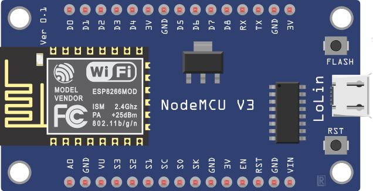

# ESP8266 NodeMCU V3 Lolin
## Não necessita de periféricos externos para funcionar.
Este firmware é ideal para realizar testes rápidos de conexão com a rede wifi e com o servidor Borker, sem que haja a necessidade de conectar sensores para verificar se esta enviando mensagens corretamente.
O dispositivo simula um sensor de temperatura e umidade e atribui valores gerados aleatoriamente para substituir as medições.
## Esquema eletrônico
