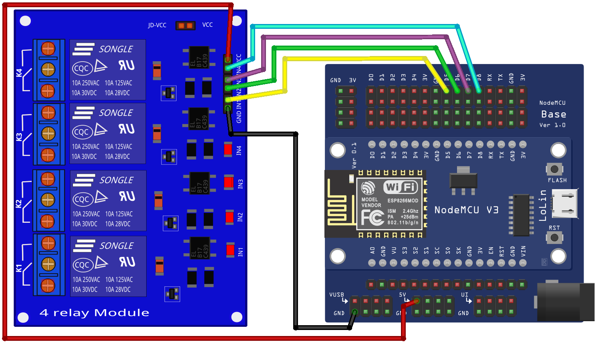

# ESP8266 NodeMCU V3 Lolin
## Módulo aplicado: Módulo relé de quatro canais
Com este dispositivo é possível acionar e desativar até quatro atuadores que estiverem na rede elétrica.
## Esquema eletrônico
